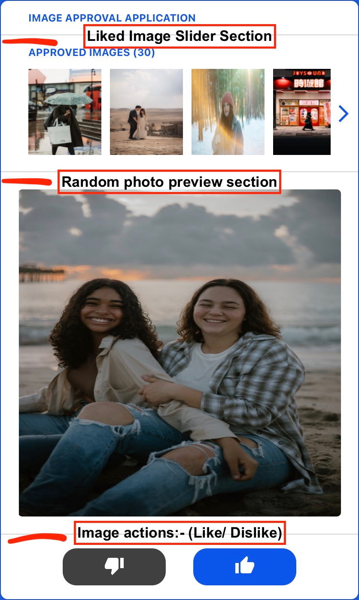

# Photo Reviewing App &nbsp; &nbsp;  &nbsp; &nbsp; &nbsp;

- Install Node >= 12.x
- Install dependencies using `npm install`
- Create a .env.local file and add variables for your local environment like this:

  - `REACT_APP_ACCESS_KEY=<your-key>`
  - `REACT_APP_FIREBASE_API_KEY=<your-secret>`
  - `REACT_APP_FIREBASE_APP_ID=<your-app-id>`
  - `REACT_APP_FIREBASE_MEASUREMENT_ID=<your-id>`
  - `REACT_APP_FIREBASE_MESSAGING_SENDER_ID=<your-id>`

- Run `npm start` to start the application
- Visit http://localhost:3000 to see the application in action

## Application Structure

- The app has three sections:

  - The first section is the liked photos slider section.
  - The second section is the random photo preview section.
  - The third section is the photo actions section.

- Top section is populated by the photos that have been liked by the user ordered by the liked time(most recent first). For first time users the list will be empty.
- Center section is populated by a random photo fetched using the Unsplash API. [Get Random Photo using Unsplash API](https://unsplash.com/documentation/#get-a-random-photo)
- Bottom section is populated by actions that can be performed on the random photo. namely, like or dislike the photo.
- The user can like or dislike the photo by clicking on the like/dislike button.
- Once the user likes the photo, the photo is inserted at first position to the top section.
- If the user dislikes the photo, user is presented with a new random photo.
- All actions are persisted in the firestore database.
- Upon reloading the app, the liked photos slider section will be populated with the photos that have been already liked by the user and the random photo section will be populated with where the user left.

  

- The liked photo slider fetches more previously liked photos from the firestore database as the user scrolls past the existing list of photos. (photos are fetched 30 at a time to optimise read query).

- disliked photos are persisted in the firebase database to be used for filtering random images fetched from external Unsplash API to avoid displaying previously disliked photos.
- If the user disliked an already liked photo, the photo is removed from the liked photos for the user.
- If the user liked an already liked photo, the photo is moved to the top of the liked photos slider section with updated liked time.

> App uses anonymous authentication for authentication/creation of user. [Anonymous Authentication using Firebase](https://firebase.google.com/docs/auth/web/anonymous-auth)

## Database Structure

> Collection and Document structure for the app in firestore.

    .
    ├── Users                                       # Collection
        ...
        ├── User                                    # Document
            ├── user_id                             # String
            ├── liked_photos                        # Subcollection
            |        ...
            |        ├── photo                      # Document
            |            ├── photo_id               # String
            |            ├── liked_time             # Timestamp
            |            └── photo_url              # String
            ├── disliked_photos                     # Subcollection
            |        ...
            |        ├── photo                      # Document
            |            ├── photo_id               # String
            |            └── photo_url              # String
            ├── random_photos                       # Array [30]
            ├── currentRandomImageIndex             # Number (0-29)
        ...

> Random photos is an Array of object with same schema as liked photos/ disliked photos. Random photos are stored 30 at a time in the firestore database. when currentRandomImageIndex is equal to 30, the next 30 photos are fetched from the unsplash API and stored in the db (to optimise API calls).

> Subcollection are reference stored in a document, this is done to structure data hierarchically, making data easier to read and write.

## Technologies Used :fire:

- React.js [https://reactjs.org/](https://reactjs.org/)
- TypeScript [https://www.typescriptlang.org/](https://www.typescriptlang.org/)
- Redux [https://redux.js.org/](https://redux.js.org/)
- Redux-saga [https://redux-saga.js.org/](https://redux-saga.js.org/)
- Immer [https://immerjs.github.io/immer/](https://immerjs.github.io/immer/)
- Firebase [https://firebase.google.com/](https://firebase.google.com/)
- Firestore [https://firebase.google.com/docs/firestore/](https://firebase.google.com/docs/firestore/)
- Unsplash API [https://unsplash.com/documentation](https://unsplash.com/documentation)
- Styled Components [https://www.styled-components.com/](https://www.styled-components.com/)
- Lodash [https://lodash.com/](https://lodash.com/)
- Axios [https://axios-http.com/docs/intro](https://axios-http.com/docs/intro)

## App Link :link:

- [https://syedad218.github.io/photo-reviewing-app/](https://syedad218.github.io/photo-reviewing-app/)

## Notes :pushpin:

- function used for filtering random photos fetched from external Unsplash API to avoid displaying previously disliked photos.

```typescript
const findDislikedImages = async (
  userId: string,
  imageIds: Array<string>
): Promise<Array<string> | []> => {
  const collectionRef = collection(db, `users/${userId}/dislikedImages`);
  let startIndex = 0;
  let endIndex = 10;
  const docsPromises = [];
  while (endIndex <= imageIds.length) {
    const batch = imageIds.slice(startIndex, endIndex);
    const q = query(collectionRef, where("id", "in", batch));
    docsPromises.push(
      getDocs(q)
        .then((docSnap) => docSnap.docs.map((doc) => doc.data().id))
        .catch((err) => err.toString())
    );
    startIndex += 10;
    endIndex += 10;
  }
  const docs = await Promise.all(docsPromises);
  const dislikedImageMatches = docs.reduce((acc, val) => acc.concat(val), []);
  return dislikedImageMatches;
};
```

> The "in" operator limits the query to be used for only an array with maximum 10 items, therefore the query is executed in batches of 10 in order to be used for all 30 images fetched from the Unsplash API.

- query used for fetching liked photos from the firestore database ordered by the liked time(most recent first) limited to 30 at a time.

```typescript
const collectionRef = collection(db, `users/${userId}/likedImages`);
const docRef = doc(db, `users/${userId}/likedImages`, lastDoc.id);
const lastDocSnap = await getDoc(docRef);
queryRef = query(collectionRef, orderBy("createdAt", "desc"), startAfter(lastDocSnap), limit(30));
const docsSnapshot = await getDocs(queryRef);
const likedImages = docsSnapshot.docs.map((doc) => doc.data());
```

- API call for fetching random images in batches of 30 from unsplash API

```typescript
const response: AxiosResponse = yield call(request, {
  method: "get",
  endpoint: "photos/random",
  config: {
    params: {
      count: 30,
      client_id: $UNSPLASH_API_KEY,
    },
  },
});
```

- Reducer InitialState Schema

```typescript
interface Image {
  id: string;
  urls: {
    small: string;
    regular: string;
  };
}

interface State {
  user: {
    id: string;
  };
  randomImages: {
    loading: boolean;
    error: string | null;
    data: Array<Image>;
  };
  currentImageIndex: number;
  likedImages: {
    loading: boolean;
    error: string | null;
    data: Array<Image>;
    hasMore: boolean;
  };
}
```

- Scroll listener using IntersectionObserver and callback ref for fetching next set of liked images from the firestore database.

```typescript
const lastElementRef = useCallback(
  (node) => {
    checkIfLastElementVisible(node, loading, hasMore, dispatch, observer);
  },
  [loading, hasMore, dispatch]
);

const checkIfLastElementVisible = (
  node: HTMLDivElement | null,
  loading: boolean,
  hasMore: boolean,
  dispatch: Dispatch<any>,
  observer: React.MutableRefObject<IntersectionObserver | null>
) => {
  if (loading) return;
  if (observer?.current) observer.current?.disconnect();
  observer.current = new IntersectionObserver((entries) => {
    if (entries[0].isIntersecting && hasMore) {
      dispatch(fetchUserLikedImages.start());
    }
  });
  if (node) observer.current?.observe(node);
};
```
